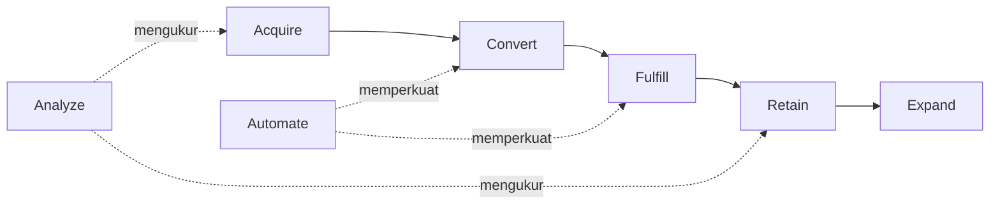
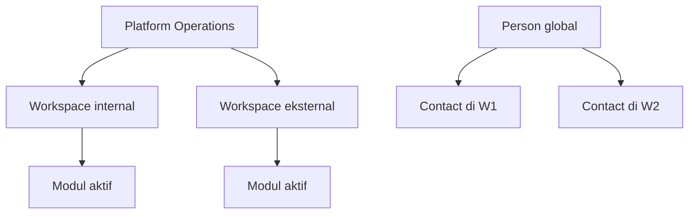
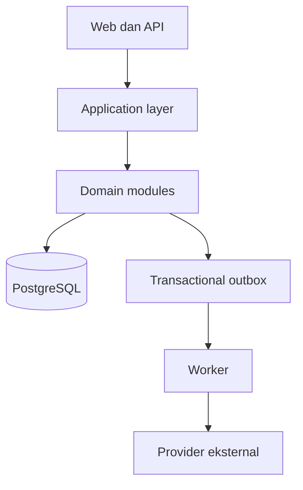
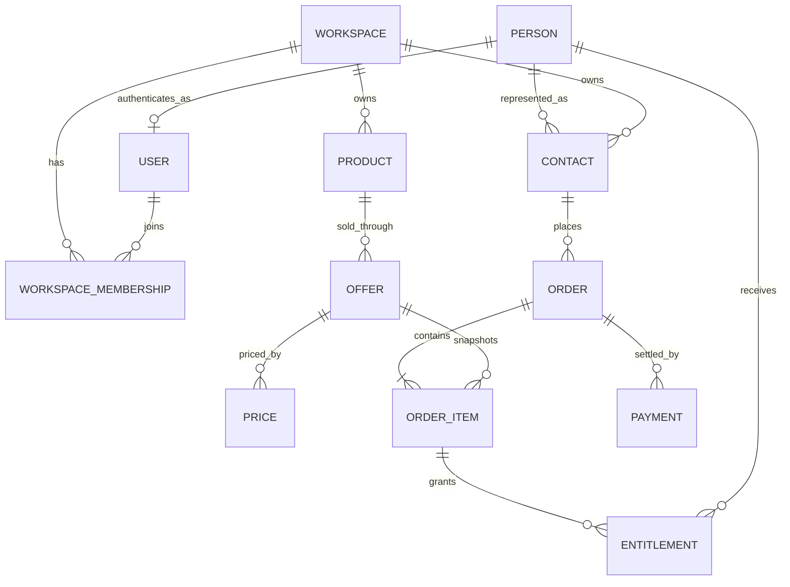
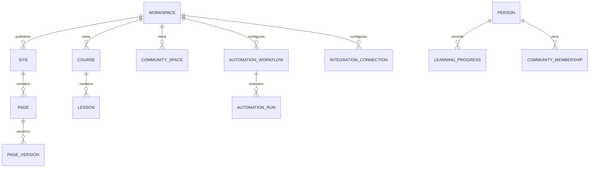

# Rizqhub Platform Foundation v1.1

**Status:** Baseline arsitektur diterima, siap memasuki M0  
**Tanggal:** 22 Juli 2026  
**Pemilik produk:** Rizqhub  
**Ruang lingkup:** Product Vision, Product Principles, Platform Blueprint, Domain Model, strategi migrasi, dan Product Roadmap  
**Dampak terhadap produksi:** Tidak ada. Dokumen ini tidak mengubah source, database, atau deployment.

## 0. Ringkasan keputusan

Rizqhub akan dikembangkan sebagai Business Operating System berbasis workspace. Sistem tetap memakai satu aplikasi modular dan satu PostgreSQL pada tahap awal. Microservices bukan target saat ini.

Keputusan yang telah diterima:

1. Rizqhub memakai identitas global. CRM, consent, transaksi, hak akses, dan data operasional tetap terisolasi per workspace.
2. Workspace dapat merepresentasikan unit bisnis internal Rizqhub maupun organisasi atau pengguna eksternal.
3. Implementasi awal memakai Modular Monolith dan PostgreSQL.
4. Domain Model menjadi sumber kebenaran utama di dalam Platform Blueprint.
5. Keputusan arsitektur utama dicatat melalui Architecture Decision Record atau ADR.
6. Source produksi tidak diubah sebelum blueprint, domain model, dan strategi migrasi disepakati.

Audit teknis memakai source Rizqhub v1.0.1 sebagai baseline resmi. Arsip valid telah diperiksa integritasnya, dibandingkan dengan v1.0.0, dan diverifikasi melalui test, lint, typecheck, serta production build. Perubahan v1.0.1 terbatas pada navigasi responsif, CSS, dokumentasi, dan nomor versi. Model data serta logika bisnis tidak berubah. Arsip tidak memuat metadata Git. Karena itu, kesesuaian byte-for-byte dengan commit produksi `84670f463104c8ae4a9570057b0fbcd0fa3c90c7` tetap harus dibuktikan pada M0 melalui repository dan tag release.

## 1. Product Vision

### 1.1 Pernyataan visi

Rizqhub adalah platform yang membantu orang dan organisasi membangun, menjalankan, serta mengembangkan bisnis melalui kapabilitas yang dapat dirangkai dalam satu workspace.

Rizqhub tidak dinilai dari jumlah fitur yang tersedia. Rizqhub dinilai dari dampaknya terhadap kemampuan pengguna untuk:

- memperoleh calon pelanggan;
- mengubah minat menjadi transaksi;
- menyerahkan produk, layanan, atau akses;
- mempertahankan hubungan pelanggan;
- meningkatkan nilai pelanggan;
- mengurangi pekerjaan manual;
- mengambil keputusan berdasarkan data.

### 1.2 Masalah yang diselesaikan

Banyak bisnis digital memakai aplikasi terpisah untuk landing page, checkout, pembayaran, pembelajaran, komunitas, komunikasi, automasi, dan analitik. Fragmentasi tersebut menimbulkan data pelanggan yang terpecah, integrasi rapuh, pekerjaan manual, dan biaya operasional yang meningkat.

Rizqhub menyatukan kapabilitas tersebut melalui model domain bersama. Setiap bisnis dapat mengaktifkan modul yang diperlukan tanpa membangun aplikasi baru.

### 1.3 Pengguna sasaran

Platform dirancang untuk:

- unit bisnis internal Rizqhub;
- kreator dan penjual produk digital;
- penyelenggara pendidikan dan pelatihan;
- konsultan dan penyedia layanan profesional;
- pengelola membership dan komunitas;
- organisasi eksternal yang membutuhkan sistem bisnis modular.

Cakupan ini tidak berarti Rizqhub harus mendukung semua jenis bisnis sejak awal. Ekspansi dilakukan berdasarkan kapabilitas yang dapat dipakai ulang dan bukti kebutuhan pasar.

### 1.4 Unit nilai platform

Unit nilai Rizqhub adalah **workspace yang aktif dan menghasilkan hasil bisnis**. Akun terdaftar, jumlah halaman, atau jumlah fitur tidak cukup menjadi ukuran keberhasilan.

North Star Metric yang direkomendasikan:

> **Jumlah Workspace Produktif Bulanan**, yaitu workspace yang dalam satu bulan menghasilkan minimal satu hasil bisnis terverifikasi, seperti transaksi berhasil, fulfillment selesai, pelanggan kembali, atau automasi yang menggantikan pekerjaan manual.

Metrik pendamping:

| Dimensi | Metrik utama |
|---|---|
| Acquire | lead berkualitas, cost per lead, source attribution |
| Convert | conversion rate, transaksi berhasil, payment success rate |
| Fulfill | fulfillment success rate, waktu sampai akses diberikan, kasus gagal |
| Retain | repeat purchase rate, renewal rate, customer retention |
| Expand | average order value, upsell take rate, revenue per customer |
| Automate | jam kerja yang dihemat, automation success rate, manual intervention rate |
| Analyze | kelengkapan event, keterlambatan data, keputusan yang menggunakan insight |

### 1.5 Batas visi

Rizqhub bukan:

- proyek untuk menyalin daftar fitur Scale.co.id;
- marketplace yang wajib mempertemukan semua penjual dengan pembeli;
- sistem ERP lengkap untuk seluruh industri;
- kumpulan fitur khusus yang dimasukkan ke inti tanpa bukti kebutuhan lintas workspace;
- proyek microservices.

## 2. Product Principles

### 2.1 Outcome before output

Setiap perubahan harus memiliki masalah pengguna, hasil bisnis, metrik, dan hipotesis yang dapat diuji. “Fitur selesai” bukan hasil bisnis.

Template keputusan minimum:

| Pertanyaan | Bukti yang dibutuhkan |
|---|---|
| Masalah apa yang terjadi? | observasi, tiket, wawancara, atau data perilaku |
| Siapa yang mengalami? | segmen workspace dan peran pengguna |
| Hasil apa yang berubah? | satu metrik utama dan guardrail |
| Mengapa Rizqhub harus menyelesaikan? | hubungan dengan kapabilitas platform |
| Bentuk solusi apa yang paling kecil? | konfigurasi, modul, integrasi, atau core |

### 2.2 Business capability over feature list

Setiap pengembangan harus dipetakan ke minimal satu kapabilitas berikut:



Urutan tersebut bukan funnel wajib. Workspace dapat memakai kombinasi berbeda sesuai model bisnisnya.

### 2.3 Workspace is the operational boundary

Branding, anggota tim, pelanggan, consent, produk, transaksi, konten, integrasi, dan analytics beroperasi dalam konteks workspace. Tidak ada operasi tenant tanpa workspace context yang eksplisit.

### 2.4 Global identity, local relationship

Orang yang sama dapat berhubungan dengan beberapa workspace. Identitas kanonik dapat global. Hubungan bisnis, consent, status pelanggan, transaksi, aktivitas, dan akses tetap milik workspace terkait.

### 2.5 Configurable by default

Variasi proses yang mempunyai konsep sama diselesaikan melalui konfigurasi. Ekstensi tidak boleh mengorbankan invariant inti, keamanan, audit, atau konsistensi data.

### 2.6 Core, module, configuration, integration, or reject

| Kategori | Kriteria |
|---|---|
| Core | dibutuhkan banyak tipe workspace dan menjaga invariant platform |
| Module | kapabilitas utuh yang hanya dibutuhkan sebagian workspace |
| Configuration | proses sama, tetapi parameter, branding, rule, atau provider berbeda |
| Integration | kapabilitas lebih baik disediakan sistem eksternal melalui kontrak stabil |
| Extension | kebutuhan khusus yang aman dijalankan di luar core melalui API atau event |
| Reject | tidak mendukung visi, tidak terukur, atau merusak batas domain |

### 2.7 Stable evolution

Migrasi memakai perubahan aditif, backfill terukur, compatibility layer, observability, dan rollback. Rewrite besar dan cutover serentak dihindari.

### 2.8 Secure and private by design

Isolasi workspace, least privilege, audit trail, consent, enkripsi, retensi data, dan penghapusan data menjadi bagian dari desain use case. Keamanan bukan pemeriksaan terakhir.

### 2.9 Events are contracts

Modul tidak boleh membaca tabel internal modul lain untuk menjalankan proses bisnis. Modul berinteraksi melalui application contract, query contract, dan domain event yang berversi.

### 2.10 Measure the whole loop

Setiap kapabilitas baru harus menetapkan event analitik, baseline, target, guardrail, dan periode evaluasi. Fitur yang tidak terukur tidak dapat diprioritaskan secara objektif.

## 3. Platform Blueprint

### 3.1 Konteks platform



Rizqhub mengoperasikan platform. Rizqhub menyediakan control plane dan workspace plane.

- **Control plane** mengelola workspace, paket, status platform, kebijakan global, dukungan, audit lintas tenant, dan operasi sistem.
- **Workspace plane** mengelola proses bisnis satu workspace dengan data dan izin yang terisolasi.

### 3.2 Gaya arsitektur

Target awal adalah Modular Monolith:

- satu repository;
- satu deployment aplikasi;
- satu cluster PostgreSQL;
- batas modul logis yang dapat diuji;
- transaksi lokal untuk invariant yang membutuhkan konsistensi kuat;
- event dan transactional outbox untuk efek lintas modul serta provider;
- worker dapat dijalankan sebagai proses terpisah tanpa menjadikan domain sebagai microservice.



### 3.3 Lapisan sistem

| Lapisan | Tanggung jawab | Larangan utama |
|---|---|---|
| Presentation | route, page, input, output, presenter | tidak menyimpan aturan bisnis |
| Application | use case, transaction boundary, policy call, orchestration | tidak mengakses provider langsung |
| Domain | entity, value object, invariant, event | tidak bergantung pada framework web |
| Infrastructure | repository, database mapping, adapter provider, storage | tidak menentukan keputusan produk |
| Platform | event bus, outbox, jobs, security, observability | tidak mengambil alih domain ownership |

Struktur source target:

```text
src/
  app/
  modules/
    identity/
    workspace/
    crm/
    catalog/
    commerce/
    entitlement/
    content/
    lms/
    community/
    membership/
    messaging/
    notification/
    automation/
    analytics/
    integration/
    operations/
  platform/
    database/
    events/
    jobs/
    security/
    storage/
    observability/
```

### 3.4 Peta kapabilitas ke modul

| Kapabilitas | Modul utama | Hasil bisnis |
|---|---|---|
| Acquire | CRM, Content, Site & Funnel, Integration | lead dan sumber akuisisi tercatat |
| Convert | Catalog, Offer, Commerce, Promotion | minat menjadi order dan pembayaran |
| Fulfill | Entitlement, LMS, Membership, Community, Delivery | hak atau layanan diberikan tepat waktu |
| Retain | CRM, Messaging, Community, Membership | hubungan dan penggunaan berlanjut |
| Expand | Offer, Promotion, Commerce, Automation | AOV, renewal, upsell, cross-sell meningkat |
| Automate | Events, Automation, Notification, Integration | pekerjaan berulang berjalan terukur |
| Analyze | Analytics, Reporting, Audit | keputusan menggunakan data tepercaya |

### 3.5 Katalog modul dan ownership

| Modul | Data yang dimiliki | Tanggung jawab | Tidak boleh mengambil alih |
|---|---|---|---|
| Identity & Access | users, persons, credentials, sessions, channels | autentikasi dan identitas global | role workspace dan consent pemasaran |
| Workspace & Team | workspaces, memberships, roles, permissions, module settings | tenant, tim, policy context | data CRM dan transaksi |
| CRM | contacts, contact channels, consents, tags, activities | hubungan person dengan workspace | autentikasi dan order ledger |
| Catalog & Offer | products, offers, prices, fulfillment rules | apa yang dijual dan cara penawarannya | payment settlement |
| Commerce & Billing | carts, orders, order items, payments, refunds, ledger, payouts | transaksi dan nilai finansial | pemberian akses modul |
| Entitlement | entitlements, grants, revocations | hak yang lahir dari pembelian atau keputusan operator | progress LMS |
| Content, Site & Funnel | sites, pages, versions, blocks, funnels, domains | publikasi dan perjalanan konversi | order settlement |
| LMS | courses, modules, lessons, progress, certificates | pengalaman belajar | definisi produk dan pembayaran |
| Community | spaces, membership mapping, posts, comments, moderation | interaksi komunitas | identitas global |
| Membership | plans, subscriptions, terms, renewals | akses berbatas waktu dan renewal | provider payment detail |
| Messaging | conversations, participants, messages | komunikasi dua arah | consent promosi |
| Notification | templates, delivery requests, attempts | delivery email, WhatsApp, in-app | keputusan kapan workflow berjalan |
| Automation | workflows, triggers, conditions, actions, runs | orkestrasi berbasis event | ownership data modul sumber |
| Analytics | events, identities, projections, reports | pengukuran dan agregasi | status transaksi sebagai sumber kebenaran |
| Integration & API | connections, credentials reference, webhooks, API clients | kontrak dengan sistem eksternal | aturan bisnis inti |
| Platform Operations | audit, health, support access, feature release | control plane dan operasi | akses tenant tanpa alasan dan audit |

### 3.6 Aturan dependensi

1. Identity dan Workspace menjadi kernel. Semua modul tenant bergantung pada `WorkspaceContext`, bukan pada `merchantId`.
2. Commerce bergantung pada snapshot Offer. Commerce tidak membaca tabel LMS.
3. Fulfillment menerima `order.paid` dan menghasilkan entitlement.
4. LMS, Community, Membership, dan Delivery memeriksa entitlement melalui kontrak Entitlement.
5. Automation bereaksi terhadap event. Automation tidak mengubah tabel internal modul secara langsung.
6. Analytics mengonsumsi event dan membangun projection. Dashboard tidak menghitung semua metrik dari query lintas tabel transaksi.
7. Integration menyediakan adapter. Domain tidak mengenal detail Xendit, Mailketing, atau StarSender.
8. Akses lintas workspace hanya melalui use case control plane yang eksplisit dan tercatat.

### 3.7 Workspace isolation

Semua agregat operasional memiliki `workspace_id` langsung. Pengecualian hanya untuk data platform-global seperti `users`, `persons`, credential autentikasi, daftar kemampuan sistem, dan konfigurasi platform.

`workspace_id` harus ada pada tabel anak ketika data dapat diakses langsung atau dipartisi secara operasional. Ketergantungan pada join ke tabel induk saja tidak cukup untuk membuktikan isolasi.

Pertahanan berlapis:

1. resolver menentukan active workspace dari domain, route, atau pilihan pengguna;
2. middleware atau application context membentuk `ActorContext`;
3. policy memeriksa membership, permission, dan ownership resource;
4. repository mewajibkan `workspace_id`;
5. PostgreSQL Row-Level Security dapat menjadi pertahanan kedua setelah jalur query stabil;
6. audit mencatat akses sensitif dan lintas workspace;
7. automated test membuktikan workspace A tidak dapat membaca atau mengubah data workspace B.

Contoh konteks:

```text
ActorContext {
  userId
  personId?
  activeWorkspaceId?
  platformPermissions[]
  membershipPermissions[]
  requestId
}
```

### 3.8 Customer 360 dan privasi

Customer 360 bukan satu tabel pelanggan global yang dapat dibaca semua workspace. Customer 360 adalah komposisi terkontrol dari identitas global dan hubungan lokal.

| Lapisan | Scope | Akses |
|---|---|---|
| Person | global | layanan identity dan platform role terbatas |
| Contact | workspace | tim workspace sesuai permission |
| Consent | workspace dan channel | CRM, automation, dan compliance workspace |
| Activity | workspace | tim workspace sesuai kebutuhan kerja |
| Cross-workspace summary | control plane | peran Rizqhub khusus dengan audit |

Aturan:

- nama yang sama tidak cukup untuk merge;
- email atau telepon dinormalisasi, lalu diverifikasi bila memungkinkan;
- merge person harus dapat diaudit dan dibatalkan;
- consent disimpan per workspace, purpose, dan channel;
- unsubscribe pada satu workspace tidak otomatis menjadi consent negatif global, kecuali diwajibkan hukum atau diminta person;
- staf workspace eksternal tidak pernah melihat aktivitas di workspace lain;
- export dan support impersonation harus memiliki alasan, durasi, dan audit.

### 3.9 Event dan automasi

Event envelope minimum:

```text
event_id
event_name
event_version
occurred_at
workspace_id
actor_id
subject_type
subject_id
correlation_id
causation_id
payload
```

Event awal yang direkomendasikan:

- `workspace.created.v1`
- `contact.created.v1`
- `contact.consent_changed.v1`
- `checkout.started.v1`
- `order.placed.v1`
- `payment.succeeded.v1`
- `order.paid.v1`
- `order.refunded.v1`
- `entitlement.granted.v1`
- `entitlement.revoked.v1`
- `course.completed.v1`
- `membership.expiring.v1`
- `community.joined.v1`

Transactional outbox menyimpan event dalam transaksi yang sama dengan perubahan domain. Worker memproses event dengan retry dan idempotency key. Dead-letter state dan replay terbatas harus tersedia.

### 3.10 Integrasi

Setiap integrasi memiliki:

- provider type;
- workspace scope atau platform default;
- secret reference, bukan secret mentah pada log;
- status koneksi;
- capability yang diaktifkan;
- webhook endpoint dan signing policy;
- retry, idempotensi, dan audit;
- fallback yang jelas.

Konfigurasi platform dapat menjadi default. Workspace boleh melakukan override jika paket dan permission mengizinkan.

### 3.11 Non-functional requirements

| Area | Baseline penerimaan |
|---|---|
| Availability | health dan readiness terpisah, deploy tanpa downtime bermakna |
| Security | least privilege, secret management, audit, rate limit, upload validation |
| Isolation | automated negative test untuk read dan write lintas workspace |
| Integrity | idempotensi payment, refund, payout, entitlement, dan delivery |
| Performance | p95 untuk operasi utama ditetapkan setelah baseline produksi tersedia |
| Recoverability | backup tervalidasi dan restore drill berkala |
| Observability | structured log, request ID, workspace ID, event ID, alert operasional |
| Migration | expand, backfill, verify, cutover, contract dengan rollback |
| Accessibility | alur publik dan dashboard mengikuti WCAG 2.2 AA sebagai target |
| Privacy | consent, export, retention, deletion, support access, dan audit |

Target angka performa belum dikunci karena telemetry produksi belum diaudit. Menetapkan angka tanpa baseline akan menciptakan target semu.

## 4. Domain Model

### 4.1 Model konseptual inti



### 4.2 Entitas inti

| Entitas | Identitas | Scope | Fungsi |
|---|---|---|---|
| Person | `person_id` | global | manusia kanonik |
| User | `user_id` | global | principal login |
| Workspace | `workspace_id` | global control plane | unit isolasi operasional |
| WorkspaceMembership | `membership_id` | workspace | hubungan user, role, dan status tim |
| Contact | `contact_id` | workspace | hubungan person dengan workspace |
| Consent | `consent_id` | workspace | izin komunikasi berdasarkan purpose dan channel |
| Product | `product_id` | workspace | sesuatu yang memberi nilai kepada pelanggan |
| Offer | `offer_id` | workspace | konfigurasi komersial untuk produk atau bundle |
| Price | `price_id` | workspace | nilai, mata uang, dan billing terms |
| Order | `order_id` | workspace | transaksi komersial dengan snapshot pembeli |
| OrderItem | `order_item_id` | workspace | item, harga, diskon, tax, dan fulfillment snapshot |
| Payment | `payment_id` | workspace | usaha dan hasil pembayaran |
| Entitlement | `entitlement_id` | workspace | hak person terhadap resource atau benefit |
| DomainEvent | `event_id` | workspace atau platform | fakta domain yang tidak berubah |

### 4.3 Model pendukung



### 4.4 Invariant utama

#### Identity dan Workspace

- User tidak menyimpan role workspace global.
- Satu user dapat memiliki membership berbeda pada beberapa workspace.
- Workspace harus memiliki minimal satu owner aktif.
- Workspace yang suspended tidak dapat memulai transaksi baru.

#### CRM

- Contact selalu dimiliki tepat satu workspace.
- Person dapat memiliki banyak contact, maksimal satu contact aktif per workspace setelah deduplikasi terverifikasi.
- Consent tidak boleh disimpulkan hanya dari transaksi.
- Perubahan consent harus append-audited.

#### Catalog dan Offer

- Product dapat hidup tanpa Course.
- Offer harus mereferensikan minimal satu item atau benefit yang dapat dipenuhi.
- Harga dan fulfillment pada order item disimpan sebagai snapshot. Perubahan offer tidak mengubah order lama.

#### Commerce

- Nilai order sama dengan penjumlahan item, diskon, pajak, dan biaya berdasarkan snapshot.
- Payment sukses harus idempoten.
- Order hanya menjadi `PAID` melalui settlement yang valid atau keputusan manual terotorisasi.
- Ledger bersifat append-only.
- Refund dan payout tidak mengubah catatan finansial lama.

#### Entitlement

- Entitlement memiliki subject, resource atau benefit, sumber pemberian, periode berlaku, dan status.
- Pemberian ulang dari sumber yang sama harus idempoten.
- Refund tidak selalu berarti pencabutan otomatis. Fulfillment rule menentukan kebijakan dan mencatat keputusan.

#### Events dan Automation

- Event yang diterbitkan merepresentasikan fakta lampau.
- Consumer harus idempoten.
- Kegagalan notifikasi tidak boleh membatalkan order paid.
- Workflow tidak boleh melewati consent atau workspace isolation.

### 4.5 Lifecycle penting

#### Workspace

```text
DRAFT -> ACTIVE -> SUSPENDED -> CLOSED
```

`CLOSED` bukan hard delete. Retensi dan penghapusan data berjalan melalui prosedur terpisah.

#### Order

```text
DRAFT -> PENDING_PAYMENT -> PAID -> FULFILLED
                     |          |        |
                     v          v        v
                  EXPIRED   REFUNDED  PARTIALLY_REFUNDED
```

State detail payment berada pada Payment. Order tidak boleh menampung seluruh status provider.

#### Entitlement

```text
PENDING -> ACTIVE -> EXPIRED
              |         
              v
           REVOKED
```

### 4.6 Data ownership matrix

| Data | Owner | Reader resmi |
|---|---|---|
| User session | Identity | Identity, security operations |
| Workspace membership | Workspace | policy engine, operations terbatas |
| Contact dan consent | CRM | automation dan messaging melalui kontrak |
| Product dan offer | Catalog | content, checkout, analytics melalui kontrak |
| Order dan payment | Commerce | entitlement, finance, analytics melalui event/query |
| Entitlement | Entitlement | LMS, community, membership, delivery |
| Learning progress | LMS | CRM timeline dan analytics melalui projection |
| Delivery attempt | Notification | automation, operations, workspace operator |
| Analytics projection | Analytics | dashboard dan reporting |

### 4.7 Pemetaan model saat ini ke target

| Saat ini | Target | Strategi |
|---|---|---|
| `users.role` | platform permission dan workspace membership | pertahankan sementara, tambahkan membership, lalu hentikan role tenant |
| `merchant_profiles` | `workspaces` dan `workspace_branding` | satu merchant menjadi satu workspace awal |
| `products.merchant_id` | `products.workspace_id` | backfill dan dual-read sementara |
| product otomatis membuat course | product + fulfillment rule | hentikan coupling setelah entitlement aktif |
| satu product utama + bump pada order | `order_items` | backfill item utama dan bump |
| enrollment sebagai akses utama | entitlement + enrollment LMS | backfill entitlement dari enrollment |
| customer dari order/enrollment | person + contact + activity | deduplikasi konservatif dan audit merge |
| role check tersebar | policy terpusat | migrasi use case per modul |
| provider via env global | integration connection | platform default lebih dahulu, override kemudian |
| analytics enum terbatas | event generik dan projection | dual-publish sebelum dashboard cutover |
| automation trigger enum | versioned domain event | adapter legacy ke workflow baru |

## 5. Strategi Migrasi

### 5.1 Prinsip migrasi

Migrasi memakai pola **expand, migrate, verify, cutover, contract**.

- **Expand:** tambah tabel, kolom, adapter, dan policy baru tanpa memutus fitur lama.
- **Migrate:** backfill data dengan job yang dapat dilanjutkan.
- **Verify:** rekonsiliasi jumlah, nilai finansial, relasi, dan isolasi.
- **Cutover:** pindahkan read dan write per use case dengan feature flag.
- **Contract:** hapus struktur lama setelah minimal satu periode stabil dan rollback tidak lagi diperlukan.

### 5.2 Guardrail produksi

1. Tidak ada migrasi destruktif pada rilis fondasi.
2. Backup dan restore drill selesai sebelum perubahan schema tenant.
3. Migration dijalankan sebagai release job tunggal, bukan oleh setiap replica.
4. Backfill memiliki checkpoint, batch size, log, dan retry.
5. Dual-write hanya digunakan sementara dan dipantau dengan reconciliation report.
6. Cutover per use case, bukan per seluruh aplikasi.
7. Payment, webhook, ledger, payout, refund, dan enrollment memiliki test idempotensi.
8. Rollback aplikasi tidak boleh memerlukan rollback data destruktif.

### 5.3 Tahap migrasi

#### M0. Baseline dan kontrol perubahan

Hasil:

- source v1.0.1 valid ditetapkan sebagai baseline dan diimpor ke repository dengan riwayat yang jelas;
- tag release dan changelog konsisten;
- schema snapshot produksi dicatat tanpa secret;
- integration, tenant isolation, checkout, webhook, refund, payout, dan restore test tersedia;
- ADR repository dibuat.

Exit criteria:

- tag baseline menunjuk source yang sama dengan artefak yang telah diverifikasi;
- hubungan baseline dengan commit produksi terdokumentasi atau dinyatakan sebagai provenance gap;
- CI menjalankan test, lint, typecheck, build, dan migration validation;
- recovery procedure terbukti di staging.

#### M1. Workspace foundation

Perubahan aditif:

- `workspaces`;
- `workspace_memberships`;
- role dan permission definitions;
- `workspace_branding`;
- `workspace_modules`;
- `workspace_domains`.

Backfill:

- satu workspace untuk setiap merchant profile;
- merchant menjadi owner membership;
- platform admin tetap menjadi platform permission.

Exit criteria:

- akun yang sama dapat menjadi anggota dua workspace;
- active workspace selalu eksplisit;
- negative isolation test lulus.

#### M2. Tenant context dan policy

- repository tenant mewajibkan workspace context;
- policy menggantikan role check per use case;
- `workspace_id` ditambahkan dan di-backfill pada data tenant;
- audit log mencatat workspace dan actor.

Cutover dimulai dari read-only dashboard, lalu write berisiko rendah. Commerce dipindahkan terakhir pada tahap ini.

Exit criteria:

- tidak ada route tenant baru yang memakai role global;
- seluruh query tenant kritis memiliki workspace predicate;
- pemeriksaan statis mencegah query tenant tanpa context.

#### M3. Identity dan CRM

- tambah person, contact, contact channel, consent, tag, dan activity;
- checkout dapat membuat contact tanpa membuat akun;
- customer dashboard membaca CRM projection;
- merge bersifat konservatif dan reversible.

Exit criteria:

- data customer per workspace terisolasi;
- consent dapat ditelusuri;
- satu person dapat memiliki contact di dua workspace tanpa kebocoran data.

#### M4. Catalog dan Commerce

- tambah offer, price, order item, payment attempt, promotion application;
- backfill semua order lama;
- pertahankan ledger dan idempotency invariant;
- putus coupling product-course pada alur pembuatan baru.

Exit criteria:

- rekonsiliasi total order dan ledger memiliki selisih nol;
- order lama tetap dapat dibaca;
- produk non-course dapat dibuat dan dijual pada staging.

#### M5. Entitlement dan fulfillment

- tambah fulfillment rule dan entitlement;
- backfill entitlement dari enrollment aktif;
- LMS dan Community membaca entitlement contract;
- refund policy mengatur pencabutan secara eksplisit.

Exit criteria:

- pemberian akses idempoten;
- akses lama dan baru konsisten;
- produk dapat memberi satu atau beberapa benefit.

#### M6. Events, outbox, automation, dan notification

- transactional outbox;
- versioned event contracts;
- worker dengan retry dan dead-letter;
- automation legacy diterjemahkan ke event baru;
- provider dipindahkan ke integration adapter.

Exit criteria:

- retry tidak menggandakan delivery;
- kegagalan provider tidak merusak transaksi;
- replay event terbatas dan dapat diaudit.

#### M7. Content, funnel, analytics, dan workspace configuration

- page version dan publishing state;
- domain mapping;
- event analytics generik;
- projection untuk funnel dan revenue;
- module activation per workspace.

Exit criteria:

- dashboard baru dapat direkonsiliasi dengan transaksi sumber;
- publish dan rollback page tersedia;
- modul nonaktif tidak membuka route atau data.

#### M8. Contract dan optimasi

- hapus compatibility layer yang tidak lagi dipakai;
- tambah constraint `NOT NULL`, foreign key, dan unique index final;
- evaluasi RLS;
- ukur bottleneck nyata;
- pertimbangkan pemisahan service hanya jika ada bukti kebutuhan scaling, reliability, atau ownership tim.

### 5.4 Rekonsiliasi wajib

| Area | Pemeriksaan |
|---|---|
| Workspace | jumlah merchant lama sama dengan workspace hasil backfill |
| Membership | setiap workspace memiliki minimal satu owner |
| Orders | jumlah dan total bruto per workspace sama sebelum dan sesudah migrasi |
| Ledger | saldo hasil agregasi tidak berubah |
| Enrollment | seluruh akses aktif memiliki entitlement yang sesuai |
| Customer | tidak ada merge otomatis hanya berdasarkan nama |
| Consent | nilai yang tidak diketahui tetap `UNKNOWN`, bukan `GRANTED` |
| Analytics | revenue projection sama dengan order paid pada toleransi nol |

### 5.5 Rollback

- Kolom dan tabel lama tetap tersedia sampai fase contract.
- Feature flag menentukan read path dan write path baru.
- Backfill tidak mengubah nilai finansial lama.
- Jika cutover gagal, aplikasi kembali membaca model lama. Data baru tetap dipertahankan untuk investigasi.
- Event consumer dapat dihentikan tanpa menghentikan checkout.
- Migrasi destruktif memerlukan ADR baru, backup terverifikasi, dan maintenance plan.

## 6. Product Roadmap

Roadmap memakai outcome gate, bukan tanggal asumtif. Durasi baru dapat dihitung setelah kapasitas tim dan velocity diketahui.

| Horizon | Outcome | Deliverable utama | Gate sebelum lanjut |
|---|---|---|---|
| Foundation | perubahan aman dan dapat diaudit | M0, ADR, CI, staging, baseline telemetry | recovery dan regression test lulus |
| Workspace | satu platform untuk banyak bisnis | M1 dan M2 | isolation test dan policy coverage lulus |
| Customer | relasi pelanggan aman dan utuh | M3 | consent dan Customer 360 scope tervalidasi |
| Commerce | produk fleksibel dan transaksi generik | M4 | rekonsiliasi finansial selisih nol |
| Fulfillment | satu pembelian dapat memberi banyak benefit | M5 | entitlement dan revocation idempoten |
| Automation | proses lintas modul dapat diorkestrasi | M6 | outbox, retry, dan audit terbukti |
| Growth | publish, funnel, dan insight modular | M7 | metrik dapat direkonsiliasi dan diukur |
| Scale | optimasi berdasarkan bukti | M8 | bottleneck dan kebutuhan organisasi terukur |

Prioritas fitur setelah fondasi harus memakai skor:

```text
Priority Score = (Business Impact × Reach × Strategic Reuse × Confidence)
                 / (Effort × Risk × Dependency Cost)
```

Skor membantu perbandingan. Skor tidak menggantikan judgment produk, keamanan, atau kewajiban hukum.

## 7. Architecture Decision Records

ADR berada pada folder `adr/`. Status yang digunakan:

- **Proposed:** belum disepakati;
- **Accepted:** telah menjadi baseline;
- **Superseded:** digantikan ADR baru;
- **Deprecated:** tidak lagi direkomendasikan, tetapi masih ada sementara;
- **Rejected:** pernah dipertimbangkan dan ditolak.

ADR awal:

| ID | Judul | Status |
|---|---|---|
| ADR-001 | Global Identity dengan Isolasi Operasional per Workspace | Accepted |
| ADR-002 | Workspace untuk Unit Internal dan Organisasi Eksternal | Accepted |
| ADR-003 | Modular Monolith dan PostgreSQL | Accepted |
| ADR-004 | Transactional Outbox untuk Side Effect Lintas Modul | Accepted |
| ADR-005 | Policy Terpusat dan RLS sebagai Pertahanan Kedua | Accepted |
| ADR-006 | Entitlement sebagai Kontrak Fulfillment | Accepted |
| ADR-007 | Migrasi Expand-Migrate-Contract | Accepted |
| ADR-008 | ADR sebagai Catatan Keputusan Arsitektur | Accepted |

## 8. Definition of Done fondasi platform

Fondasi dianggap selesai jika:

- satu user dapat bergabung pada beberapa workspace dengan role berbeda;
- satu workspace dapat memiliki beberapa anggota tim;
- workspace internal dan eksternal memakai model yang sama;
- seluruh data tenant kritis memiliki workspace scope;
- test otomatis membuktikan isolasi read dan write;
- contact dapat ada tanpa akun login;
- consent disimpan per workspace dan channel;
- produk dapat dibuat tanpa course;
- order mempunyai order items dan payment terpisah;
- pembelian memberi entitlement yang idempoten;
- LMS dan Community tidak menentukan akses dari order secara langsung;
- event lintas modul memakai outbox dan consumer idempoten;
- Customer 360 lintas workspace hanya tersedia pada control plane yang diaudit;
- data finansial lama dapat direkonsiliasi tanpa selisih;
- deployment memiliki rollback dan restore yang teruji.

## 9. Risiko terbuka

| Risiko | Dampak | Mitigasi |
|---|---|---|
| arsip v1.0.1 tidak memuat metadata Git | hubungan dengan commit produksi tidak dapat dibuktikan dari ZIP | impor baseline ke repository, catat checksum, dan buat tag release pada M0 |
| automated test saat ini sangat terbatas | regresi tenant dan transaksi tidak terdeteksi | tambah integration dan E2E sebelum perubahan schema kritis |
| 63 dari 89 file mengakses database langsung | batas modul mudah dilanggar | migrasi per use case dan aturan import |
| 176 referensi `merchantId` | kebocoran tenant saat rename parsial | compatibility layer, inventory, dan isolation test |
| identitas dan customer bercampur | merge salah dan kebocoran data | person-contact split dan merge reversible |
| product terikat course | model bisnis non-kursus terhambat | offer, fulfillment rule, entitlement |
| status transaksi menyerap detail provider | kompleksitas dan inkonsistensi | payment attempt terpisah dan snapshot order |
| Customer 360 disalahartikan sebagai akses global | risiko privasi tinggi | control plane permission, consent, audit, dan data minimization |

## 10. Keputusan implementasi

ADR-001 sampai ADR-008 berstatus Accepted. Penerimaan ADR-005 tidak berarti RLS langsung diaktifkan pada seluruh tabel. Policy application layer, propagasi workspace context, repository scoping, dan negative isolation test harus stabil terlebih dahulu. Penerimaan ADR-007 juga tidak mengizinkan dual-write tanpa batas waktu. Setiap compatibility layer wajib memiliki owner, metrik rekonsiliasi, cutover gate, dan rencana penghapusan.

Implementasi dimulai dari **M0 Baseline dan Kontrol Perubahan**, lalu **M1 Workspace Foundation**. Rincian backlog, schema target awal, pengujian, rollout, dan exit criteria terdapat pada `M0_M1_Implementation_Spec_v1.0.md`. Source dan deployment produksi belum diubah.
